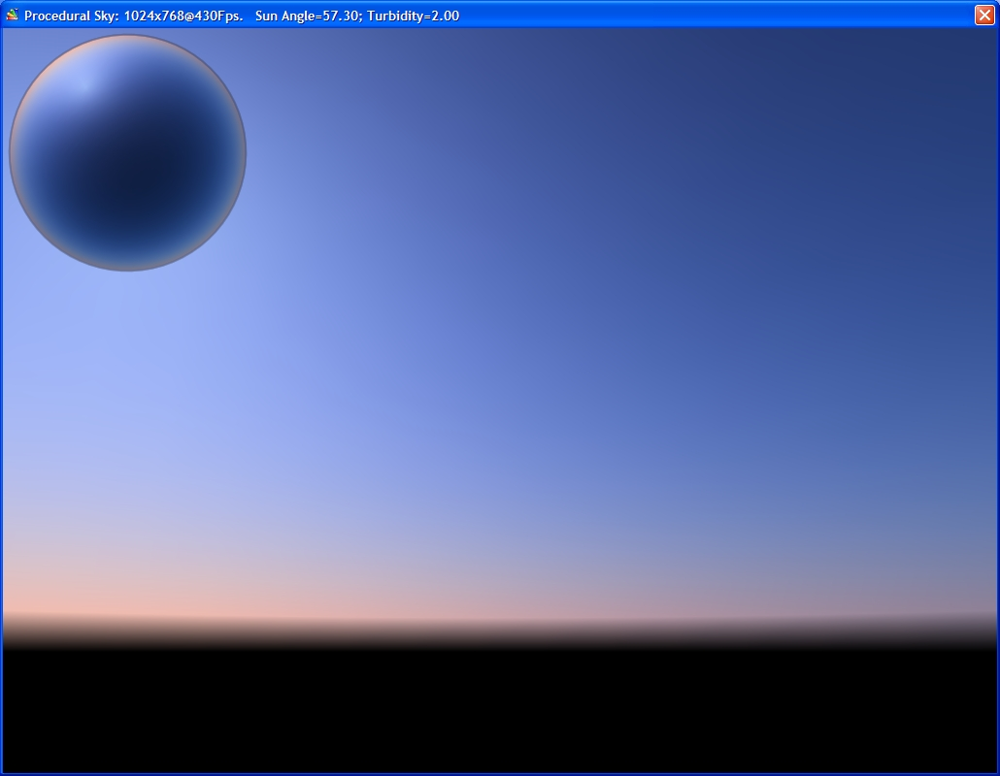



## Procedural Sky

### Description

Dynamic procedural sky hemisphere based on perez all-weather sky color model. Use W,S keys to change sun angle; A,D - adjust turbidity; SPACE - toggles zenith viewport.
 
### More Info
 

             |
---                |---
**Submitted On**   |2007-07-21 09:14:48
**By**             |[\[dev\] Fg](https://github.com/Planet-Source-Code/PSCIndex/blob/master/ByAuthor/dev-fg.md)
**Level**          |Intermediate
**User Rating**    |4.3 (13 globes from 3 users)
**Compatibility**  |VB 6\.0
**Category**       |[DirectX](https://github.com/Planet-Source-Code/PSCIndex/blob/master/ByCategory/directx__1-44.md)
**World**          |[Visual Basic](https://github.com/Planet-Source-Code/PSCIndex/blob/master/ByWorld/visual-basic.md)
**Archive File**   |[Procedural2083769182007\.zip](https://github.com/Planet-Source-Code/dev-fg-procedural-sky__1-69353/archive/master.zip)

